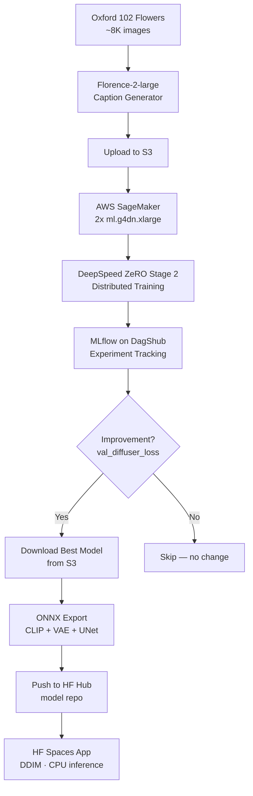
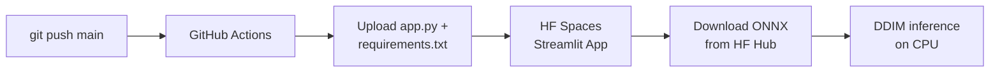
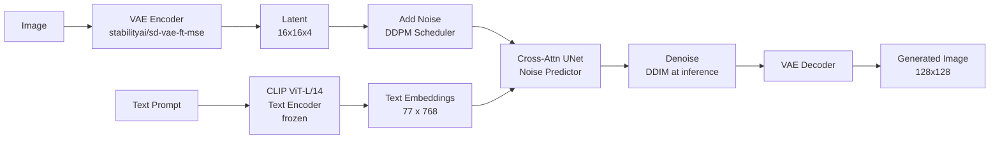

# Text-to-Image Generation with Diffusion Models

[](https://python.org)
[](https://pytorch.org)
[](https://aws.amazon.com/sagemaker/)
[](https://deepspeed.ai)
[](https://dvc.org)
[](https://dagshub.com)
[](https://onnx.ai)
[](https://streamlit.io)
[](https://huggingface.co/spaces)

> End-to-end text-to-image diffusion model trained on AWS SageMaker with distributed DeepSpeed, tracked with MLflow, exported to ONNX, and deployed to Hugging Face Spaces — all orchestrated with DVC.

**[Live Demo on HF Spaces](https://huggingface.co/spaces/YOUR_HF_USERNAME/text-to-image-demo)** · **[Model on HF Hub](https://huggingface.co/YOUR_HF_USERNAME/text-to-image-diffusion)** · **[Experiment Tracking (MLflow)](https://dagshub.com/aniketpoojari/Text-To-Image-Diffusion.mlflow)**

---

## Pipeline Overview



### CI/CD: Auto-deploy on git push



---

## Model Architecture



---

## Tech Stack

| Component | Technology | Role |
|---|---|---|
| Caption generation | Florence-2-large | Auto-label flower images with detailed captions |
| Text encoding | CLIP ViT-L/14 | Convert prompts to 768-dim embeddings |
| Image compression | VAE ft-mse (SD) | Encode/decode images in 8× compressed latent space |
| Noise predictor | UNet2DConditionModel | Cross-attentional UNet for denoising |
| Training infra | AWS SageMaker | 2× ml.g4dn.xlarge (NVIDIA T4) spot instances |
| Distributed training | DeepSpeed ZeRO Stage 2 | Memory-efficient data-parallel training across nodes |
| Mixed precision | FP16 (AMP) | Faster training with lower memory footprint |
| CFG training | 10% unconditional dropout | Enables classifier-free guidance at inference |
| Experiment tracking | MLflow on DagShub | Hyperparameters, metrics, model registry |
| Pipeline | DVC | Reproducible, cached stages from data to deployment |
| ONNX export | torch.onnx | Optimized CPU inference for all 3 model components |
| Deployment | HF Spaces + GitHub Actions | Auto-deploy on git push; DDIM inference in browser |

---

## Sample Outputs

Generated with DDIM · 50 steps · CFG 7.5:

| Prompt | Result |
|--------|--------|
| A bright yellow sunflower with green leaves |  |
| A red rose with water droplets on its petals |  |
| A purple lavender field at sunset |  |
| A white daisy on a grassy meadow |  |
| A pink cherry blossom tree in spring |  |

---

## Training Results

| Metric | Value |
|---|---|
| Training platform | 2× ml.g4dn.xlarge (NVIDIA T4, 16 GB VRAM each) |
| Distribution | DeepSpeed ZeRO Stage 2 |
| Best val diffuser loss | *see MLflow* |

Full experiment logs: [DagShub MLflow](https://dagshub.com/aniketpoojari/Text-To-Image-Diffusion.mlflow)

---

## Setup & Usage

### 1. Clone and install

```bash
git clone https://github.com/aniketpoojari/Text-to-Image-Generation.git
cd Text-to-Image-Generation
pip install -r requirements.txt
```

### 2. Configure params

```bash
cp params.yaml.template params.yaml
# Edit params.yaml — fill in AWS, MLflow, and HuggingFace credentials
```

### 3. Run the full DVC pipeline

```bash
dvc repro
```

This runs all stages in order:

| Stage | What it does |
|---|---|
| `caption-generator` | Generates captions for flower images using Florence-2-large |
| `data-push` | Uploads dataset to S3 for SageMaker |
| `training` | Launches distributed DeepSpeed training job on SageMaker |
| `log_training_model` | Downloads best model from MLflow/S3 (only if val loss improved) |
| `onnx_convert` | Exports CLIP + VAE + UNet to ONNX (requires CUDA locally) |
| `push_to_hub` | Pushes ONNX models + diffuser.pth to HF Hub model repo |

### 4. Run the app locally

```bash
cd saved_models
streamlit run app.py
```

Supports both PyTorch and ONNX backends. Select in the sidebar.

### 5. Deploy to HF Spaces (automated)

On every `git push` to `main`, GitHub Actions automatically uploads `app.py` and `requirements.txt` to your HF Space.

**One-time setup:**
1. Create a Streamlit Space on [huggingface.co/new-space](https://huggingface.co/new-space)
2. In the Space settings, add variable: `HF_MODEL_REPO=your-username/text-to-image-diffusion`
3. In your GitHub repo settings → Secrets, add:
   - `HF_TOKEN` — your HF access token
   - `HF_SPACES_REPO` — e.g. `your-username/text-to-image-demo`

---

## Project Structure

```
├── .github/
│   └── workflows/
│       └── deploy_to_hf_spaces.yml  # Auto-deploy to HF Spaces on push
├── data/
│   └── raw/flowers/
│       ├── images/                  # Oxford 102 Flowers dataset
│       └── captions/                # Florence-2-generated captions
├── samples/                         # Sample generated images (committed to git)
├── saved_models/
│   ├── app.py                       # Streamlit app (local + HF Spaces)
│   ├── requirements.txt             # HF Spaces dependencies
│   ├── diffuser.pth                 # Trained UNet (DVC-tracked)
│   └── onnx_models/                 # ONNX exports (DVC-tracked)
├── src/
│   ├── code/                        # SageMaker container code
│   │   ├── dataloader.py
│   │   └── training_sagemaker_deepspeed.py
│   ├── caption_generator.py         # Florence-2 caption pipeline
│   ├── trainingjob.py               # SageMaker job launcher
│   ├── log_training_model.py        # Download best model from MLflow/S3
│   ├── onnx_converter.py            # PyTorch → ONNX export
│   ├── push_to_hub.py               # Upload models to HF Hub
│   ├── upload.py                    # Dataset upload to S3
│   └── common.py                    # Shared utilities
├── notebooks/
│   └── Diffusion.ipynb              # Exploration & analysis
├── dvc.yaml                         # Pipeline definition
├── params.yaml.template             # Config template (copy → params.yaml)
├── requirements.txt                 # Full project dependencies
└── MODEL_CARD.md                    # Model documentation
```

---

## Key Design Decisions

**Why DeepSpeed ZeRO Stage 2?**
ZeRO Stage 2 partitions optimizer states and gradients across GPUs, enabling training of larger models on the same hardware. It allows us to fit a full UNet2DConditionModel + pretrained VAE on 2× T4 instances that would otherwise OOM.

**Why ONNX for deployment?**
ONNX Runtime on CPU is significantly faster than PyTorch CPU inference due to graph optimization and kernel fusion. This makes the HF Spaces demo (CPU-only) practical with 30 DDIM steps.

**Why DDIM over DDPM at inference?**
DDPM requires 1000 steps for generation. DDIM is a deterministic sampler that achieves comparable quality in 30–50 steps — a 20–33× speedup, critical for CPU deployment.

**Why only download on improvement?**
The `log_training_model` stage compares the new best run's `val_diffuser_loss` against the currently deployed model's metadata. If there's no improvement, the file hashes don't change and DVC skips all downstream stages (`onnx_convert`, `push_to_hub`).
