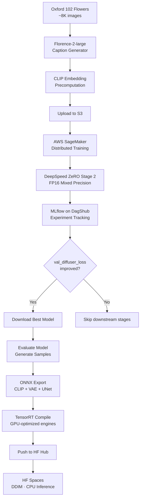
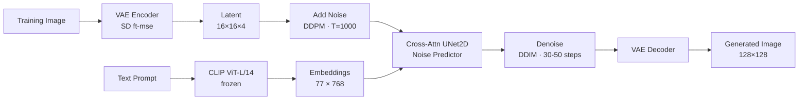

# Text-to-Image Generation with Diffusion Models

[](https://python.org)
[](https://pytorch.org)
[](https://aws.amazon.com/sagemaker/)
[](https://deepspeed.ai)
[](https://dvc.org)
[](https://dagshub.com)
[](https://onnx.ai)
[](https://streamlit.io)
[](https://huggingface.co/spaces/aniketp2009gmail/text-to-image-flowers)

An end-to-end text-to-image diffusion model — from data preparation and caption generation through distributed training on AWS SageMaker, experiment tracking with MLflow, model optimization (ONNX / TensorRT), to automated deployment on Hugging Face Spaces via CI/CD.

**[Live Demo](https://huggingface.co/spaces/aniketp2009gmail/text-to-image-flowers)** · **[Model on HF Hub](https://huggingface.co/aniketp2009gmail/flower-diffusion)** · **[Experiment Tracking](https://dagshub.com/aniketpoojari/Text-To-Image-Diffusion.mlflow)** · **[System Design](SYSTEM_DESIGN.md)**

---

## Sample Outputs

Generated with DDIM · 50 steps · CFG 5.0 · avg 2.37 s/image (GPU):

| | | | | |
|:---:|:---:|:---:|:---:|:---:|
|  |  |  |  |  |
| *Yellow sunflower* | *Red rose* | *Purple lavender* | *White daisy* | *Cherry blossom* |

---

## Pipeline Overview

The entire workflow — data prep, training, evaluation, export, and deployment — is orchestrated as a single reproducible DVC pipeline.



### DVC Stages

| # | Stage | What it does |
|---|---|---|
| 1 | `caption-generator` | Auto-generates detailed captions for ~8K flower images using Florence-2-large |
| 2 | `precompute-embeddings` | Pre-caches CLIP text embeddings to disk, eliminating per-batch CLIP inference |
| 3 | `data-push` | Uploads dataset (images + captions + embeddings) to S3 for SageMaker |
| 4 | `training` | Launches distributed DeepSpeed training on SageMaker (2 nodes) |
| 5 | `log_training_model` | Downloads best model from S3 — **only if val loss improved** |
| 6 | `evaluate` | Generates sample images and computes evaluation metrics |
| 7 | `onnx_convert` | Exports CLIP + VAE + UNet to ONNX for CPU inference |
| 8 | `tensorrt_convert` | Compiles ONNX models to TensorRT engines for GPU inference |
| 9 | `push_to_hub` | Pushes all model artifacts to Hugging Face Hub |

Stages 5–9 are automatically skipped by DVC when the model doesn't improve, preventing unnecessary exports and deployments.

### CI/CD: Auto-deploy on `git push`


---

## Model Architecture



| Component | Details |
|---|---|
| **Text Encoder** | CLIP ViT-L/14 (`openai/clip-vit-large-patch14`) — frozen, 768-dim embeddings |
| **VAE** | Stable Diffusion VAE (`stabilityai/sd-vae-ft-mse`) — 8× latent compression |
| **UNet** | `UNet2DConditionModel` with cross-attention — channels [192, 384, 576] |
| **Scheduler** | DDPM (1000 steps, training) → DDIM (30–50 steps, inference) |
| **Output** | 128 × 128 px |

---

## Training

| | |
|---|---|
| **Dataset** | Oxford 102 Flowers (~8,189 images) |
| **Captions** | Auto-generated with Florence-2-large |
| **Platform** | AWS SageMaker — 2× `ml.g4dn.xlarge` (NVIDIA T4, 16 GB each) |
| **Distribution** | DeepSpeed ZeRO Stage 2 — optimizer states + gradients partitioned |
| **Precision** | FP16 mixed precision |
| **Optimizer** | AdamW (lr=2e-4, weight_decay=1e-2) + cosine warmup |
| **Batch size** | 64 |
| **Epochs** | 75 |
| **Gradient clipping** | 0.5 |
| **CFG training** | 10% unconditional dropout |
| **Best val loss** | 0.3124 |
| **Experiment logs** | [DagShub MLflow](https://dagshub.com/aniketpoojari/Text-To-Image-Diffusion.mlflow) |

---

## Tech Stack

| Component | Technology |
|---|---|
| Caption generation | Florence-2-large (Microsoft) |
| Text encoding | CLIP ViT-L/14 (OpenAI) |
| Image compression | Stable Diffusion VAE ft-mse |
| Noise prediction | UNet2DConditionModel (HF Diffusers) |
| Training infrastructure | AWS SageMaker (multi-node spot instances) |
| Distributed training | DeepSpeed ZeRO Stage 2 |
| Experiment tracking | MLflow on DagShub |
| Pipeline orchestration | DVC |
| Model optimization | ONNX Runtime (CPU) · TensorRT (GPU) |
| Deployment | Hugging Face Spaces + GitHub Actions CI/CD |
| App framework | Streamlit |

---

## Project Structure

```
├── .github/workflows/
│   └── deploy_to_hf_spaces.yml     # CI/CD — auto-deploy to HF Spaces on push
├── data/raw/flowers/
│   ├── images/                      # Oxford 102 Flowers dataset (~8K images)
│   ├── captions/                    # Florence-2-generated captions
│   └── embeddings/                  # Pre-cached CLIP embeddings
├── samples/                         # Generated sample images
├── saved_models/
│   ├── app.py                       # Streamlit app (local + HF Spaces)
│   ├── Dockerfile                   # HF Spaces container
│   ├── requirements.txt             # HF Spaces dependencies
│   ├── diffuser.pth                 # Trained UNet weights (DVC-tracked)
│   ├── onnx_models/                 # ONNX exports (DVC-tracked)
│   └── trt_models/                  # TensorRT engines (DVC-tracked)
├── src/
│   ├── code/                        # SageMaker training container
│   │   ├── dataloader.py            # Dataset with CLIP embedding cache
│   │   └── training_sagemaker_deepspeed.py
│   ├── caption_generator.py         # Florence-2 caption pipeline
│   ├── precompute_embeddings.py     # CLIP embedding precomputation
│   ├── trainingjob.py               # SageMaker job launcher
│   ├── log_training_model.py        # Best model download (conditional)
│   ├── evaluate.py                  # Model evaluation + sample generation
│   ├── onnx_converter.py            # PyTorch → ONNX export
│   ├── tensorrt_converter.py        # ONNX → TensorRT compilation
│   ├── push_to_hub.py               # Upload to HF Hub
│   ├── upload.py                    # Dataset upload to S3
│   └── common.py                    # Shared utilities
├── notebooks/
│   └── Diffusion.ipynb              # EDA & exploration
├── dvc.yaml                         # Pipeline definition (9 stages)
├── params.yaml.template             # Config template
├── requirements.txt                 # Project dependencies
├── MODEL_CARD.md                    # Model documentation
└── SYSTEM_DESIGN.md                 # System architecture & design decisions
```

---

## Setup & Usage

### 1. Clone and install

```bash
git clone https://github.com/aniketpoojari/Text-To-Image-Diffusion.git
cd Text-To-Image-Diffusion
pip install -r requirements.txt
```

### 2. Configure

```bash
cp params.yaml.template params.yaml
# Fill in AWS credentials, MLflow URI, and HF token
```

### 3. Run the full pipeline

```bash
dvc repro
```

### 4. Run the app locally

```bash
cd saved_models
streamlit run app.py
```

Supports three inference backends — select in the sidebar:
- **ONNX Runtime** — CPU-optimized (default on HF Spaces)
- **TensorRT** — fastest on NVIDIA GPUs
- **PyTorch** — full precision, any device

### 5. Deploy to HF Spaces

Automated via GitHub Actions on every push to `main`. One-time setup:

1. Create a Docker Space on [huggingface.co/new-space](https://huggingface.co/new-space)
2. Add GitHub repo secrets: `HF_TOKEN`

---

## Key Design Decisions

**Why precompute CLIP embeddings?**
CLIP inference was the per-batch bottleneck during training. Pre-caching embeddings to disk as `.pt` files eliminates this overhead entirely and enables multi-worker data loading.

**Why DeepSpeed ZeRO Stage 2?**
Partitions optimizer states and gradients across GPUs. This fits the full UNet + pretrained VAE on 2× T4 instances (16 GB each) that would otherwise OOM with standard data parallelism.

**Why conditional model download?**
The `log_training_model` stage compares the new run's `val_diffuser_loss` against the current model's metadata. If no improvement, file hashes stay the same and DVC automatically skips all downstream stages — no unnecessary ONNX exports or HF Hub uploads.

**Why DDIM over DDPM at inference?**
DDPM requires 1000 denoising steps. DDIM achieves comparable quality in 30–50 steps — a 20–33× speedup critical for CPU-based deployment on HF Spaces.

**Why ONNX for deployment?**
ONNX Runtime CPU inference is significantly faster than PyTorch CPU due to graph optimization and kernel fusion. This makes the HF Spaces demo (CPU-only free tier) practical.

For a deeper dive into architecture and trade-offs, see **[SYSTEM_DESIGN.md](SYSTEM_DESIGN.md)**.
