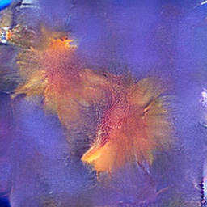
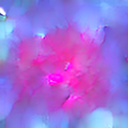
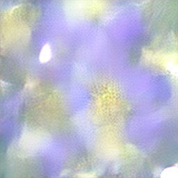
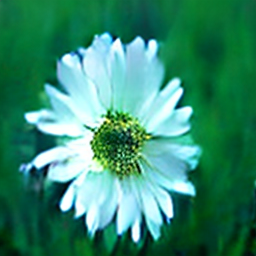
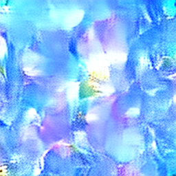

# Sample Generated Images

Images generated by the trained diffusion model using **DDIM · 50 steps · CFG 7.5**.

To generate your own samples locally:

```bash
cd saved_models
streamlit run app.py
```

---

| Prompt | Image |
|--------|-------|
| A bright yellow sunflower with green leaves |  |
| A red rose with water droplets on its petals |  |
| A purple lavender field at sunset |  |
| A white daisy on a grassy meadow |  |
| A pink cherry blossom tree in spring |  |

> Note: Run the Streamlit app, enter the prompts above, and save the generated images as `sample_1.png` … `sample_5.png` in this directory. Then commit them to the repo so they display here on GitHub.
